# Ответы к колоквиуму по курсу "Математический анализ"

## <a name="начало"> Навигация по странице:

 + [*1* Первый вопрос](#Parag1);
 + [*2* Второй вопрос](#Parag2);
 + [*3* Третий вопрос](#Parag3);
 + [*4* Четвертый вопрос](#Parag4);
 + [*5* Пятый вопрос](#Parag5);
 + [*6* Шестой вопрос](#Parag6);
 + [*7* Седьмой вопрос](#Parag7);
 + [*8* Восьмой вопрос](#Parag8);
 + [*9* Девятый вопрос](#Parag9);
 + [*10* Десятый вопрос](#Parag10);
 + [*11* Одиннадцатый вопрос](#Parag11);
 + [*12* Двенадцатый вопрос](#Parag12);
 + [*13* Тринадцатый вопрос](#Parag13);
 + [*14* Четырнадцатый вопрос](#Parag14);
 + [*15* Пятнадцатый вопрос](#Parag15);
 + [*16* Шестнадцатый вопрос](#Parag16);
 + [*17* Семнадцатый вопрос](#Parag17);
 + [*18* Восемнадцатый вопрос](#Parag18);
 + [*19* Девятнадцатый вопрос](#Parag19);
 + [*20* Двадцатый вопрос](#Parag20);
 + [*21* Двадцать первый вопрос](#Parag21);
 + [*22* Двадцать второй вопрос](#Parag22);
 + [*23* Двадцать третий вопрос](#Parag23);
 + [*24* Двадцать четвертый вопрос](#Parag24);
 + [*25* Двадцать пятый вопрос](#Parag25);
 + [*26* Двадцать шестой вопрос](#Parag26);
 + [*27* Двадцать седьмой вопрос](#Parag27);
 + [*28* Двадцать восьмой вопрос](#Parag28);
 + [*29* Двадцать девятый вопрос](#Parag29);
 + [*30* Тридцатый вопрос](#Parag30);

###  1. Опишите аксиомы теории вещественных чисел. Какие из известных вам числовых множеств удовлетворяют этим аксиомам?

####  [тык к началу](#начало)

---

A1. Коммутативность сложения: $a + b = b + a$

A2. Ассоциативность сложения: $(a + b) + c = a + (b + c)$

A3. Коммутативность умножения: $a \cdot b = b \cdot a$

A4. Ассоциативность умножения: $(a \cdot b) \cdot c = a \cdot (b \cdot c)$

A5. Дистрибутивность: $a \cdot (b + c) = a \cdot b + a \cdot c$

A6. Существование нуля: $\exists 0 \in \mathbb{R}$, такое что $a + 0 = a$

A7. Существоание противоположного: $\exists -a \in \mathbb{R}$, такое что $a + (-a) = 0$

A8. Существование единицы: $\exists 1 \in \mathbb{R}$, такое что $a \cdot 1 = a$

A9. Существование обратного: $\exists a^{-1} \in \mathbb{R}$, такое что $a \cdot a^{-1} = 1$

### Сравнение вещественных чисел

A10. Рефлективность: Для любого числа справдливо $a \leq a$

A11. Транзитивность: Для любых чисел $a, b, c$ справдливо $a \leq b$ и $b \leq c$ $\Rightarrow$ $a \leq c$

A12. Антисимметричность: Для любых чисел $a, b$ справдливо $a \leq b$ и $b \leq a$ $\Rightarrow$ $a = b$

A13. Линейность: Для любых чисел $a, b, c, d$ справдливо $a \leq b$ и $c \leq d$ $\Rightarrow$ $ac \leq bd$

A14. Монотонность сложения (по правому аргументу): Для любых чисел $a, b, c$ справдливо $a \leq b$ $\Rightarrow$ $a + c \leq b + c$

A15. Сохранение знака + при умножениии: Для любых чисел $a, b, c, d$ справдливо $a \leq b$ и $c \leq d$ $\Rightarrow$ $ac \leq bd$

A16. Непрерывность вещественной прямой: Для любых чисел $a, b$ справдливо $a \leq b$ $\Rightarrow$ существует $x \in (a, b)$, такой что $x \leq a$ и $x \leq b$

---

###  2. Дайте определение минимума и максимума числового множества. Дайте определение точной нижней грани и точной верхней грани числового множества.

####  [тык к началу](#начало)

---

Пусть $X$ - числовое множество. Число $a$ называется минимумом $X$, если $a$ - наименьшее число из $X$. Число $a$ называется максимумом $X$, если $b$ - наибольшее число из $X$.
В таких случаях пишут: 

$$\min X = a$$

$$\max X = b$$

Точная нижняя граница числового множества $X$ - это число $a$, такое что $a \leq x$ для любого $x \in X$. Точная верхняя граница числового множества $X$ - это число $b$, такое что $b \geq x$ для любого $x \in X$.

Точная верхняя граница числового множества $X$ - это число $b$, такое что $b \geq x$ для любого $x \in X$.

---

###  3. Дайте опредение модуля числа. Перечислите свойства модуля числа.

####  [тык к началу](#начало)

---

Модуль числа $a$ - это число $|a|$, которое определяется следующим образом:

$$|a| = \begin{cases} a, & a \geq 0 \\ -a, & a < 0 \end{cases}$$

Свойства модуля числа:

A1. $|a| \geq 0$

A2. $|a| = a$ или $|a| = -a$

A3. $|a| = |-a|$

A4. $|a + b| = |a| + |b|$

A5. $|ab| = |a||b|$

A6. $|a| = 0 \Rightarrow a = 0$

A7. $|a| = |b| \Rightarrow a = b$ или $a = -b$

A8. $|a| \neq |b| \Rightarrow a \neq b$ и $a \neq -b$

A9. $|a| \geq |b| \Rightarrow a \geq b$ или $a \leq -b$

---

###  4. Дайте определение натурального числа. Сформулируйте теорему о доказательстве методом математичекой ндукции.

####  [тык к началу](#начало)

---

Натуральное число - это число, которое можно получить из нуля при помощи последовательного прибавления единицы. Натуральные числа обозначаются $1, 2, 3, 4, \dots$

Принцип математической индукции: 

Пусть $P(n)$ - утверждение, которое верно для натурального числа $n$. Если $P(1)$ верно, то $P(n)$ верно для любого натурального числа $n$, если $P(n)$ верно для натурального числа $n$, то $P(n + 1)$ верно для натурального числа $n + 1$.

---

###  5. Сформулируйте теорему об определениях методом математической индукции. Привидите примеры определений по индукции.

####  [тык к началу](#начало)

---

Пусть $X$ - некоторое множество и дано отображение $G$, которое **каждой** конечной последовательности элементов $x_1, x_2, \dots, x_n$ из $X$ ставит в соответствие некоторый элемент $g(x_1, x_2, \dots, x_n)$ из $X$. Тогда $G$ называется операцией над $X$. Тогда для всякого начального элемента $x_1 \in X$ отображение $G$ однозанчно определит бесконечную последовательность содержащую $x_1$ в качестве первого элемента и удовлетворяющую условию:

Для любого $n \in \mathbb{N}$:
$x_{n + 1} = g(x_1, x_2, \dots, x_n)$

Доказательство. Зафиксируем $x_1 \in X$ и обозначим через $E$ подмножество в $\mathbb {N}$, состоящее из всех натуральных чисел, для которых существует конечная последовательность $x_1,x_2, \dots ,x_n \in X$ со следующим свойством: 

$$\forall{k} = 2, \dots, n$$ 
$$G(x_1,\dots,x_n) = x_{n+1}$$

Тогда, во-первых, $1 \in E$, потому что для $n = 1$ нужная последовательность должны состоять только из одного числа, и таким числом будет $x_1$. И, во-вторых, если $n \in E$, то $n + 1 \in E$, потому что для $n + 1$ можно взять последовательность $x_1, x_2, \dots, x_n, x_{n + 1}$, где $x_{n + 1} = G(x_1, x_2, \dots, x_n)$.

Таким образом, по принципу математической индукции, $E=\mathbb{N}$, следовательно, что для всякого $n \in \mathbb{N}$ можно выбрать $x_n$ по такому правилу: выбираем какую-нибудь конечную последовательность $x_1, x_2, \dots, x_n$ и применяем к ней операцию $G$, тогда получим $x_{n + 1} = G(x_1, x_2, \dots, x_n)$. 

---

###   6. Сформулируйте принцип Архимеда. Ограничено ли множество натуральных чисел?

####  [тык к началу](#начало)

---

Принцип Архимеда. Для любого вещественного числа $C \in R$ найдется натуральное число $n \in \mathbb{N}$ такое, что $n > C$.

Доказательство. Зафиксируем число $C \in \mathbb{R}$, и предположим противное, то есть что для него не существует такого $n \in \mathbb{N}$, чтобы $n > C$. Тогда для всякого $n \in \mathbb{N}$ мы получаем $n \leqslant C$. Иными словами, $C$ ограничиывает множество $\mathbb{N}$ сверху. Но это противоречит тому, что $C \in \mathbb{R}$, а значит, $C$ не может ограничивать множество $\mathbb{N}$ сверху.

Доказательство. Предположим, что наоборот $\mathbb{N}$ ограничено сверху. Тогда по теореме должно иметь точную верхнюю грань: 

$$\exists \sup \mathbb{N} = B \in \mathbb{R}$$

Поскольку $B$ - точная верхняя грань, число $B - 1$ не может ограничивать $\mathbb{{N}}$ сверху. Значит, существует какое-то $n \in \mathbb{N}$, большее $B - 1$, и таким образом, $n > B - 1$. То есть

$$ B < n+1$$

Это означает, что $B$ не является точной верхней гранью, а значит, $\mathbb{N}$ не ограничено сверху.

---

###  7. Дайте определение целого и рационального числа. Каким из аксиом вещественных чисел удовлетворяют целые и рациональные числа?

####  [тык к началу](#начало)

---

Число $x \in \mathbb{R}$ называется **целым**, если оно

* либо натуральное (то есть $x \in \mathbb{N}$)

* либо противоположное натуральному (то есть $x = -n$, где $n \in \mathbb{N}$)

в соответствии с этим, множество целых чисел, обозначаемое символом $\mathbb{Z}$, определяется следующим образом:

$$\mathbb{Z} = \mathbb{N} \cup (-\mathbb{N})\$$

Свойства множества $\mathbb{Z}$:

1. Сумма двух целых чисел также целое число. 

$$\forall x, y \in \mathbb{Z} \quad \Rightarrow x + y \in \mathbb{Z}$$

2. Произведение двух целых чисел также целое число.

$$\forall x, y \in \mathbb{Z} \quad \Rightarrow x \cdot y \in \mathbb{Z}$$

3. Число $-x$, противоположное $x$, также целое число.

$$\forall x \in \mathbb{Z} \quad \Rightarrow  -x \in \mathbb{Z}$$

### Рациональные числа $\mathbb{Q}$

Число $x \in \mathbb{R}$ называется **рациональным**, если оно является отношением двух целых чисел: 

$$x = \frac{a}{b}, \quad a \in \mathbb{Z},\quad b \in \mathbb{N}^*$$

В соответствии с этим, множество рациональных чисел, обозначаемое символом $\mathbb{Q}$, определяется следующим образом:

$$\mathbb{Q} = \frac{\mathbb{Z}}{\mathbb{N}^*}$$

Свойства множества $\mathbb{Q}$:

1. Сумма двух рациональных чисел также рациональное число.

$$\forall x, y \in \mathbb{Q} \quad \Rightarrow x + y \in \mathbb{Q}$$

2. Произведение двух рациональных чисел также рациональное число.

$$\forall x, y \in \mathbb{Q} \quad \Rightarrow x \cdot y \in \mathbb{Q}$$

3. Число $-x$, противоположное $x$, также рациональное число.

$$\forall x \in \mathbb{Q} \quad \Rightarrow  -x \in \mathbb{Q}$$

4. Число $x^{-1}$ (обратное $x$), также рациональное число.

$$\forall x \in \mathbb{Q}  \quad \Rightarrow  x^{-1} \in \mathbb{Q}$$ 
ПРИМЕЧАНИЕ: $x^{-1}$ определено только для $x \neq 0$.

---

###  8. Дайте определение числовой функции. Привидите примеры. Дайте определения функции ограниченной сверху и функции ограниченной снизу. Дайте определение точной нижней грани и точной верхней грани на множестве. Дайте определение монотонной функции.

####  [тык к началу](#начало)

---

Числовой функцией на вещественной прямой $\mathbb{R}$
называется произвольное отображение 

$f: \mathbb{R} \to \mathbb{R}$, у которого бласть определения $D(f)$ содержится в $\mathbb{R}$. В дальнейшем мы будем использовать в таких случаях: 

$$f: \mathbb{R} \to \mathbb{R}$$

Интуитивнее яснее, хотя и менее точно, звучит следующее определение:

**Числовой функцией на вещественной прямой $\mathbb{R}$ называется произвольное отображение $f: \mathbb{R} \to \mathbb{R}$, у которого область определения $D(f)$ содержится в $\mathbb{R}$ и каждому элементу $x \in D(f)$ сопоставляется элемент $f(x) \in \mathbb{R}$**.

Числовая функция называется ограниченной на множестве $E \subseteq D(f)$, если она ограничена сверху и снизу, то существуеют такие числа $A$ и $B$, что:

$$\forall x \in E \quad A \leq f(x) \leq B$$

 ****Точная нижняя грань**** множества $f(E)$ называется точной нижней гранью функции $f$ на множестве $E$ и обозначается $\inf{_{x \in E}}f(x)$.

$$\forall x \in E \quad \inf{_{x \in E}}f(x) \leq f(x)$$

Eсли функция $f$ ограничена снизу на множестве $E$, то есть такое число $A$, что:

$$\forall x \in E \quad A \leq f(x)$$

(это эквивалентно тому, что множество $f(E$) ограничено снизу), то точная нижняя грань функции $f$ на множестве $E$ совпадает с наибольшим из таких чисел $A$:

$$\inf{_{x \in E}}f(x) = \max\{A \mid \forall x \in E \quad A \leq f(x)\}$$

В таких случаях $\inf{_{x \in E}}f(x)$ является числом (а не символом $-\infty$), то точная верхняя грань на $f$ на $E$ совпадает с наибольшим из таких чисел $A$:

$$\inf{_{x \in E}}f(x) > -\infty$$

В противном случае говорят, если $E$ не ограничено снизу на множестве $E$, то точная нижняя грань функции $f$ на множестве $E$ не существует и обозначается символом $-\infty$ и записывается:

$$\inf{_{x \in E}}f(x) = -\infty$$

****Точная верхняя грань**** множества $f(E)$ называется точной верхней гранью функции $f$ на множестве $E$ и обозначается $\sup{_{x \in E}}f(x)$.

$$\forall x \in E \quad f(x) \leq \sup{_{x \in E}}f(x)$$

Eсли функция $f$ ограничена сверху на множестве $E$, то есть такое число $B$, что:

$$\forall x \in E \quad f(x) \leq B$$

(это эквивалентно тому, что множество $f(E$) ограничено сверху), то точная верхняя грань функции $f$ на множестве $E$ совпадает с наименьшим из таких чисел $B$:

$$\sup{_{x \in E}}f(x) = \min\{B \mid \forall x \in E \quad f(x) \leq B\}$$

В таких случаях $\sup{_{x \in E}}f(x)$ является числом (а не символом $+\infty$), то точная верхняя грань на $f$ на $E$ совпадает с наименьшим из таких чисел $B$:

$$\sup{_{x \in E}}f(x) < +\infty$$

В противном случае говорят, если $E$ не ограничено сверху на множестве $E$, то точная верхняя грань функции $f$ на множестве $E$ не существует и обозначается символом $+\infty$ и записывается:

$$\sup{_{x \in E}}f(x) = +\infty$$

***Монотонные функции***

Функция $f$ называется монотонной на множестве $E$, если она возрастает на $E$:

$$\forall x, y \in E \quad x \leq y \Rightarrow f(x) \leq f(y)$$

или убывает на $E$:

$$\forall x, y \in E \quad x \leq y \Rightarrow f(x) \geq f(y)$$

***Функция, удовлетворяющая условию***

Функция $f$ называется функцией, удовлетворяющей условию $P$, если она удовлетворяет условию $P$ на множестве $E$:

$$\forall x \in E \quad P(x) \Rightarrow f(x)$$

***Функция, не удовлетворяющая условию***

Функция $f$ называется функцией, не удовлетворяющей условию $P$, если она не удовлетворяет условию $P$ на множестве $E$:

$$\exists x \in E \quad P(x) \Rightarrow f(x)$$

Примеры: 

* $f(x) = x^2$ - монотонная на $[0, +\infty)$
* $f(x) = \frac{1}{x}$ - монотонная на $(0, +\infty)$
* $f(x) = \frac{1}{x}$ - не монотонная на $(-\infty, 0)$

---

###  9. Дайте определение числовой последовательности. Объясните смысл выражения «почти все $n$». Объясните смысл выражения «почти все элементы последовательности $х$, лежат в множестве $M$». Сформулируйте теорему Архимеда.

####  [тык к началу](#начало)

---

***Числовая последовательность***

Числовая последовательность $\{x_n\}$ называется последовательностью, если $x_n$ - число для любого $n \in \mathbb{N}$.

***Почти все $n$***
Последовательность $\{x_n\}$ называется последовательностью, если $x_n$ - число для любого $n \in \mathbb{N}$.

***Почти все элементы последовательности $х$, лежат в множестве $M$***

Последовательность $\{x_n\}$ называется последовательностью, если $x_n$ - число для любого $n \in \mathbb{N}$.

***Теорема Архимеда***

Пусть $x_n$ - последовательность, $x_n \to a$. Тогда существует $N \in \mathbb{N}$, такое что для любого $n \geq N$ выполняется неравенство $|x_n - a| < \varepsilon$, где $\varepsilon > 0$ - произвольно малое число.

---

###  10. Дайте определение окрестности $U_z(а)$ точки $a$. Дайте определение конечного и бесконечного пределов последовательности. Что такое сходящаяся последовательность? Сформулируйте теорему о единственности предела последовательности.

####  [тык к началу](#начало)

---

***Окрестность точки***

Окрестностью точки $c \in \mathbb{R}$ называется всякий интервал с центром в точке $c$, то есть всякий интервал вида ($c-e;c+e$), число $e$ называется радиусом окрестности точки $c$.

***Конечный предел***

Точка $c \in \mathbb{R}$ называется конечным пределом последовательности $\{x_n\}$,если любая ее окрестность ($c-e;c+e$) содержить *почти все элементы $x_n$*. В таком случае пишут:

$$\lim_{n \to \infty} x_n = c$$

***Бесконечный предел***

Говорят, что числовая последовательность {$x_n$}

- стремится к +бесконечности, если $\lim_{n \to \infty} x_n = +\infty$;

- стремится к -бесконечности, если $\lim_{n \to \infty} x_n = -\infty$.

- стремится к бесконечности, если $\lim_{n \to \infty} x_n =  \infty$.

***Сходящаяся последовательность***

Последовательность $\{x_n\}$ называется сходящейся, если $\lim_{n \to \infty} x_n = c$.

Пример сходящейся последовательности:

$$x_n = \frac{1}{n}$$

---

###  11.Дайте определение бесконечно малой последовательности. Объясните связь между ними. Сформулируйте критерий сходимости последовательности в терминах существования бесконечно малой последовательности.

####  [тык к началу](#начало)

---

***Бесконечно малая последовательность***

Последовательность $\{x_n\}$ называется бесконечно малой, если $\lim_{n \to \infty} x_n = 0$.

По модулю тоже стремится к нулю.

Пример бесконечно малой последовательности:

$$x_n = \frac{1}{n^2}$$

***Связь между бесконечно малой и сходящейся последовательностью***

Последовательность $\{x_n\}$ сходится, если и только если существует бесконечно малая последовательность $\{x_n\}$.

***Критерий сходимости***

Если для последовательности  существует некое число  такое, что какой бы отступ  от этого числа мы ни взяли, начиная с какого-то момента все члены последовательности лежат в пределах этого отступа — вот в этом случае последовательность называется сходящейся, а число  называется её пределом.

---

###  12.Перечислите арифметические свойства пределов последовательностей.

####  [тык к началу](#начало)

---

***Свойства пределов последовательностей***

1. Если $x_n \to a$ и $y_n \to b$, то $x_n + y_n \to a + b$.

2. Если $x_n \to a$ и $y_n \to b$, то $x_n - y_n \to a - b$.

3. Если $x_n \to a$ и $y_n \to b$, то $x_n \cdot y_n \to a \cdot b$.

4. Если $x_n \to a$ и $y_n \to b$, то $\frac{x_n}{y_n} \to \frac{a}{b}$.

5. Если $x_n \to a$ и $y_n \to b$, то $x_n^{y_n} \to a^b$.

6. Если $x_n \to a$, то $x_n^k \to a^k$.

---

###  13.Сформулируйте теорему о предельном переходе в неравенствах. Справедлива ли она для строгих неравенств?

####  [тык к началу](#начало)

---

***Теорема о предельном переходе в неравенствах***

Если последовательности $x_n$, $y_n$ связаны неравенством вида $x_n \leqslant y_n$, то $\lim_{n \to \infty} x_n \leqslant \lim_{n \to \infty} y_n$.

Справедлива для строгих неравенств.

Пример: 

$z_n$ = $\frac{n}{n^2+1}$

$z_n$ = $\frac{1}{n+1} > 0 = x_n, \forall x_n \in \mathbb{N}$. 
С другой стороны $z_n \leqslant x_n$.

$$z_n = \frac{n}{n^2+1} < \frac{n}{n^2} = \frac{1}{n} =  y_n$$

То есть, имеем: $0 < \frac{n}{n^2+1} < \frac{1}{n}$ и из этого следует, что $\lim_{n \to \infty} z_n = 0 < \lim_{n \to \infty} x_n = \lim_{n \to \infty} y_n$.

---

###  14. Сформулируйте теорему "о двух милиционерах". Справедлива ли она для строгих неравенств?

####  [тык к началу](#начало)

---

***Теорема "о двух милиционерах"***

Если два миллиционера $x_n$ и $z_n$ идут в милицейский участок $a$: $x_n \to a$ и $z_n \to a$, то $\lim_{n \to \infty} x_n = \lim_{n \to \infty} z_n = a$, то оказавшийся между ними Даня тоже пойдет в участок $x_n \leqslant y_n \leqslant z_n$:

$$\lim_{n \to \infty} y_n = a$$

---

###  15. Сформулируйте теорему Вейерштрасса о монотонных последовательностях. Справедлива ли она для строгих неравенств?

####  [тык к началу](#начало)

---

***Теорема Вейерштрасса о монотонных последовательностях***

Любая монотонная ограниченная последовательность $x_n$ имеет конечный предел, равный точной верней границе, sup $x_n$ для неубывающей и точной нижней границе, inf $x_n$ для невозрастающей последовательности.
Любая монотонная неограниченная последовательность имеет бесконечный предел, равный плюс бесконечности, $+\infty$  для неубывающей и минус бесконечности, $-\infty$  для невозрастающей последовательности.

Доказательство:

Пусть $x_n$ - монотонная неубывающая последовательность. Пусть $x_n \to a$. Тогда $a \geqslant x_n \forall n \in \mathbb{N}$. Тогда $a \geqslant \lim_{n \to \infty} x_n = sup x_n$.

Справедлива для строгих неравенств.

---

###  16. Сформулируйте теорему о вложенных отрезках. Справедлива ли она для открытых интервалов?

####  [тык к началу](#начало)

---

***Теорема о вложенных отрезках***

Для любой последовательности вложенных отрезков существует точка $c \in \mathbb{R}$ принадлежащая всем этим отрезкам.
Если длины отрезков стремятся к нулю, то $c$ - точка пересечения этих отрезков.

$$\lim_{n \to \infty} (b-a_n)=0$$

то такая точка единственная.

Справедлива ли для открытых интервалов? 
- Нет, не справедлива. Например, $[0,1]$ и $[1,2]$.

---

###  17. Сформулируйте теорему Больцано-Вейерштрасса.

####  [тык к началу](#начало)

---

***Теорема Больцано-Вейерштрасса***

Из любой последовательности действительных чисел можно выделить подпоследовательность, сходящуюся или к конечному числу, или к $+\infty$ или к $-\infty$ .

---

###  18. Сформулируйте критерий Коши сходимости последовательности.

####  [тык к началу](#начало)

---

***Критерий Коши сходимости последовательности***

Последовательность $x_n$ сходится к $a$ по Коши, если и только если $\forall \varepsilon > 0$ существует $N \in \mathbb{N}$, такое что $\forall n \geqslant N$ выполняется неравенство $|x_n - a| < \varepsilon$.

И в переводе на русский язык эти определения следует понимать так:

Если для последовательности $x_n$  существует некое число $A$ такое, что какой бы отступ $e>0$  от этого числа мы ни взяли, начиная с какого-то момента все члены последовательности лежат в пределах этого отступа — вот в этом случае последовательность называется сходящейся, а число $A$ называется её пределом:

$$\lim_{n \to \infty} x_n = A$$

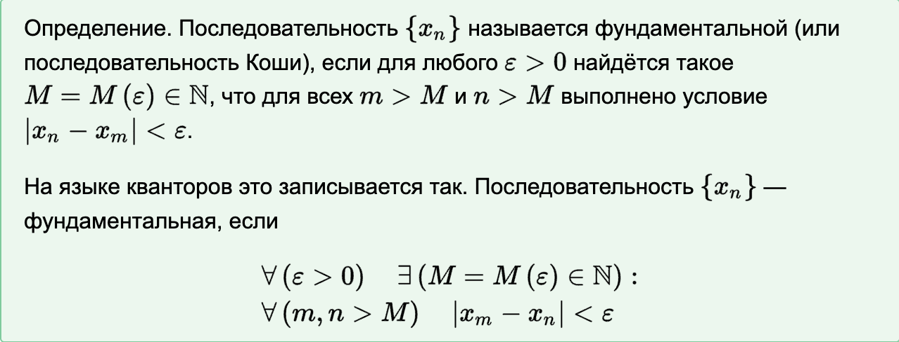
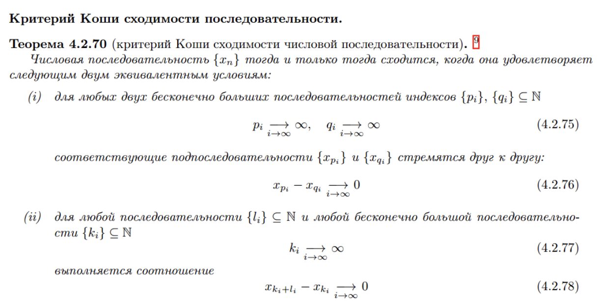
---

###  19. Дайте определение числу Непера е.

####  [тык к началу](#начало)

---

***Число Непера е***

$e$ — основание натурального логарифма, математическая константа, иррациональное и трансцендентное число. Приблизительно равно 2,71828. Иногда число $e$ называют числом Эйлера или числом Непера. Обозначается строчной латинской буквой «e».

число может быть определено как предел последовательности:

$$e = \lim_{n \to \infty} (1 + \frac{1}{n})^n$$

Как сумма ряда:

$$e = \sum_{n=0}^{\infty} \frac{1}{n!}$$

---

###  20. Дайте определение непрерывной функции на множестве. Сформулируйте теорему об арифметических операциях с непрерывными функциями.

####  [тык к началу](#начало)

---

***Непрерывная функция на множестве***

Функция $f(x)$ называется непрерывной на множестве $A$, если для любого $x \in A$ выполняется неравенство $|f(x) - f(a)| < \varepsilon$, где $\varepsilon > 0$.

***Теорема об арифметических операциях с непрерывными функциями***

Пусть $f(x)$ и $g(x)$ — непрерывные функции на множестве $A$. Тогда:

1. $f(x) + g(x)$ — непрерывная функция на множестве $A$.

2. $f(x) - g(x)$ — непрерывная функция на множестве $A$.

3. $f(x) \cdot g(x)$ — непрерывная функция на множестве $A$.

4. $f(x) / g(x)$ — непрерывная функция на множестве $A$.

---

###  21. Сформулируйте теорему о композиции непрерывных функций.

####  [тык к началу](#начало)

---

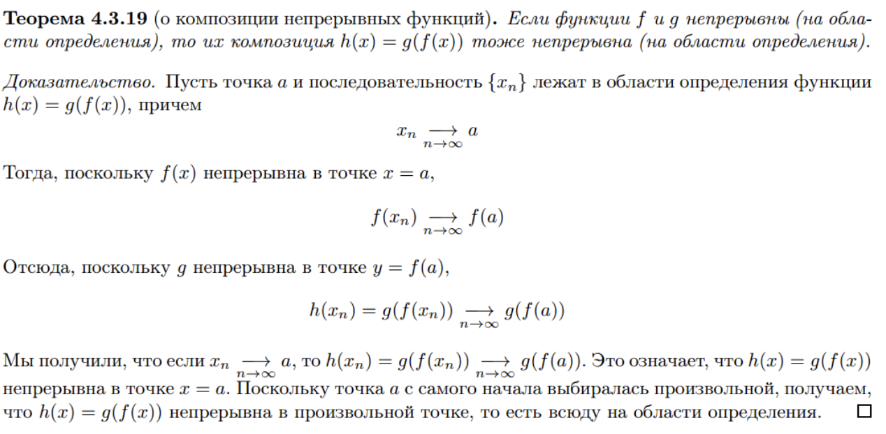

---

###  22. Сформулируйте теорему о сохранении знака непрерывной функцией. 

####  [тык к началу](#начало)

---

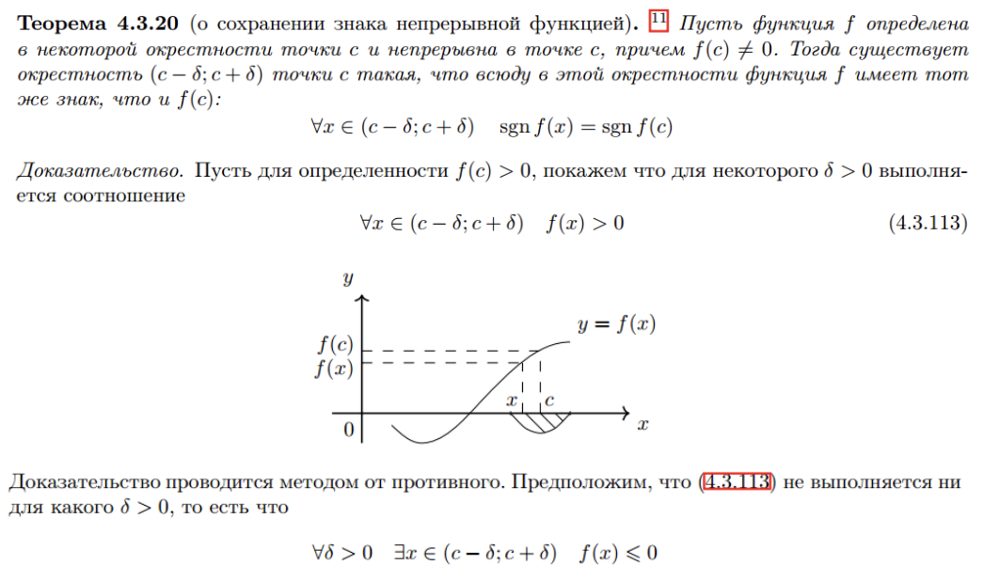
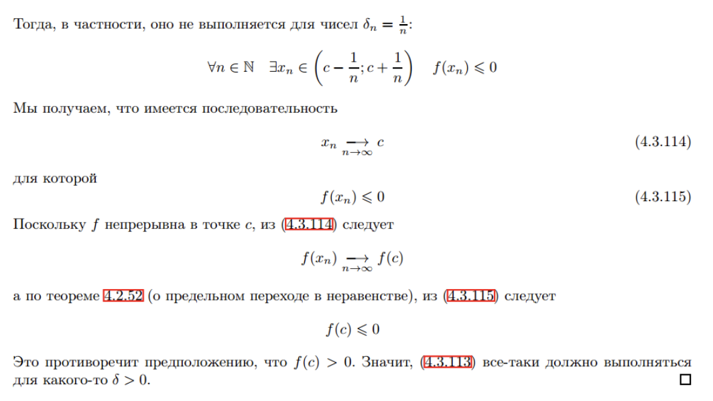

---

###  23. Сформулируйте теорему Коши о промежуточном значении.

####  [тык к началу](#начало)

---

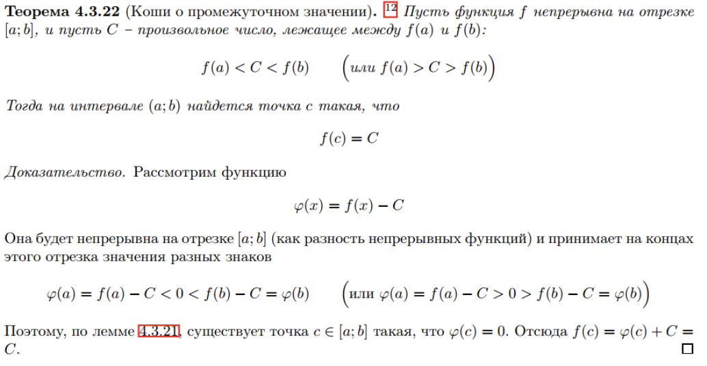

---

###  24. Сформулируйте теорему Вейерштрасса об ограниченности.

####  [тык к началу](#начало)

---

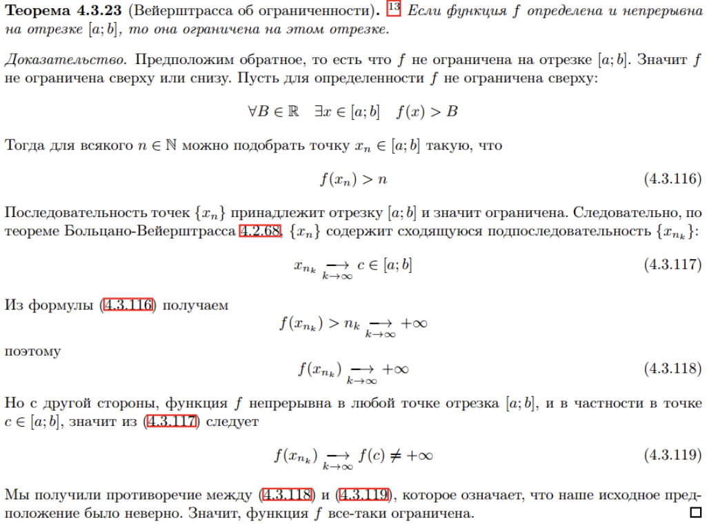

---

###  25. Сформулируйте теорему Вейерштрасса об экстремумах.

####  [тык к началу](#начало)

---

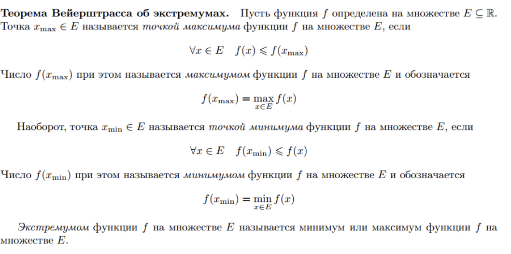

---

###  26. Дайте определение равномерно непрерывной функции на множестве. Приведите примеры. Сформулируйте теорему Кантора о равномерной непрерывности.

####  [тык к началу](#начало)

---

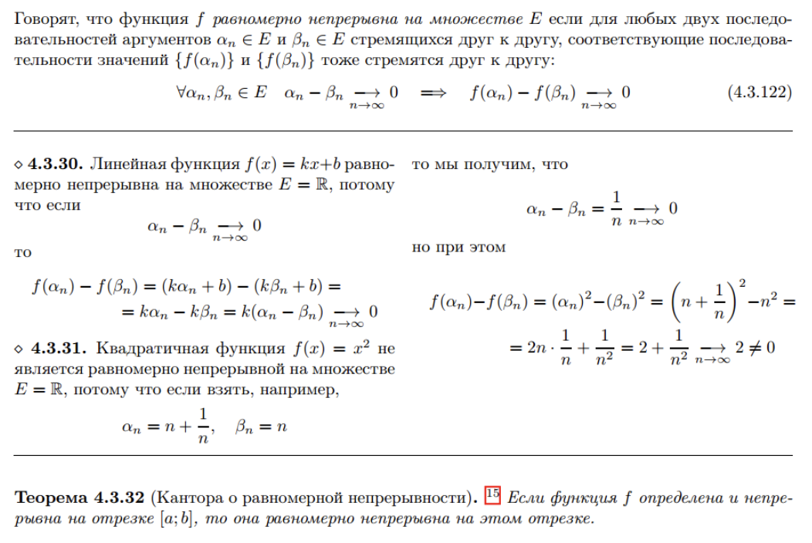

---

###  27. Дайте определение предела функции по Гейне. Приведите примеры.

####  [тык к началу](#начало)

---

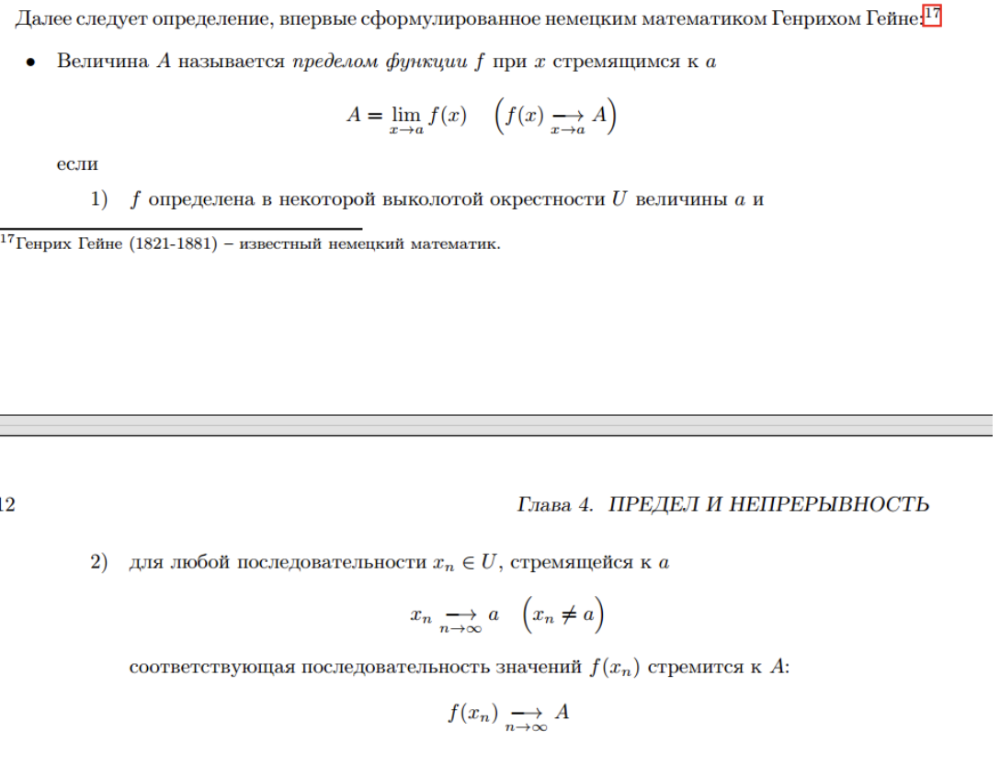

---

###  28. Сформулируйте теорему о пределе непрерывной функции.

####  [тык к началу](#начало)

---

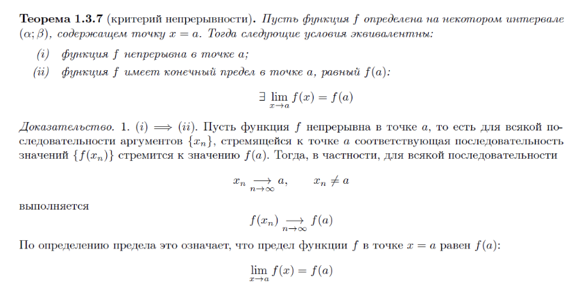

---

###  29. Сформулируйте теорему о замене переменной под знаком предела.

####  [тык к началу](#начало)

---

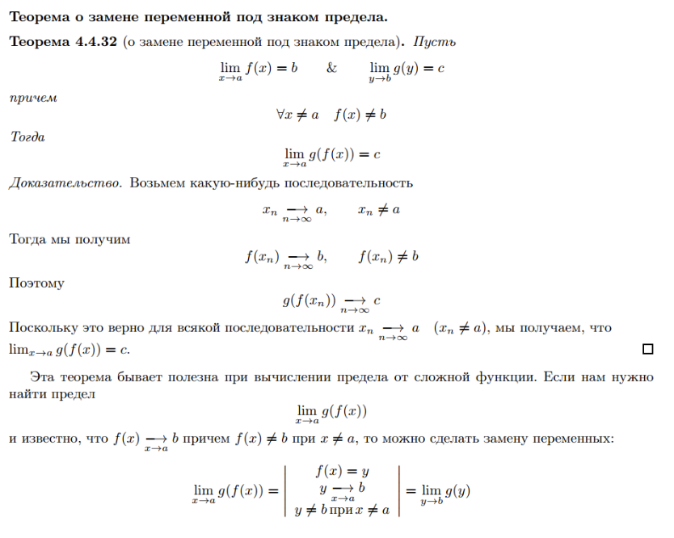

---

###  30. Перечислите арифметические свойства предела функции.

####  [тык к началу](#начало)

---

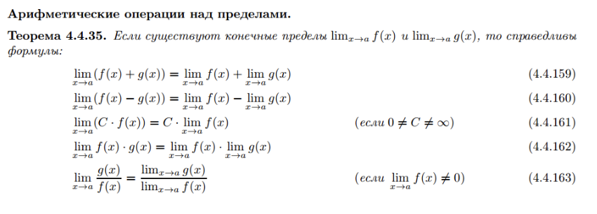

---